# Operationalizing Machine Learning Final Project
In this project, I build an end-to-end ML model pipeline with the Bank Marketing dataset. I discuss how to train a model through the Azure ML Studio, publishing the pipeline, and consuming it so that we can make predictions through an API request.

## Architectural Diagram
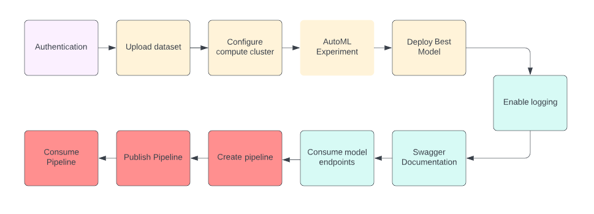

## Key Steps

### 1. Authentication
I must create a Service Principal using az. However, since I used the VM, I was unable to do this because I did not have the proper permissions.

### 2. Automated ML Experiment
The next step is to create an experiment using Automated ML, configure a compute cluster, and use that cluster to run the experiment. Using the Bank Marketing dataset,  I trained the data using a binary classification model (the target column being `y`) to identify customers who were influenced by the bank's marketing campaign. Below are screenshots of the uploaded data and the finished experiment.
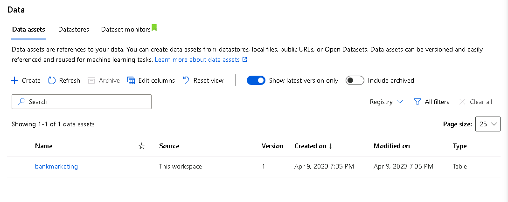
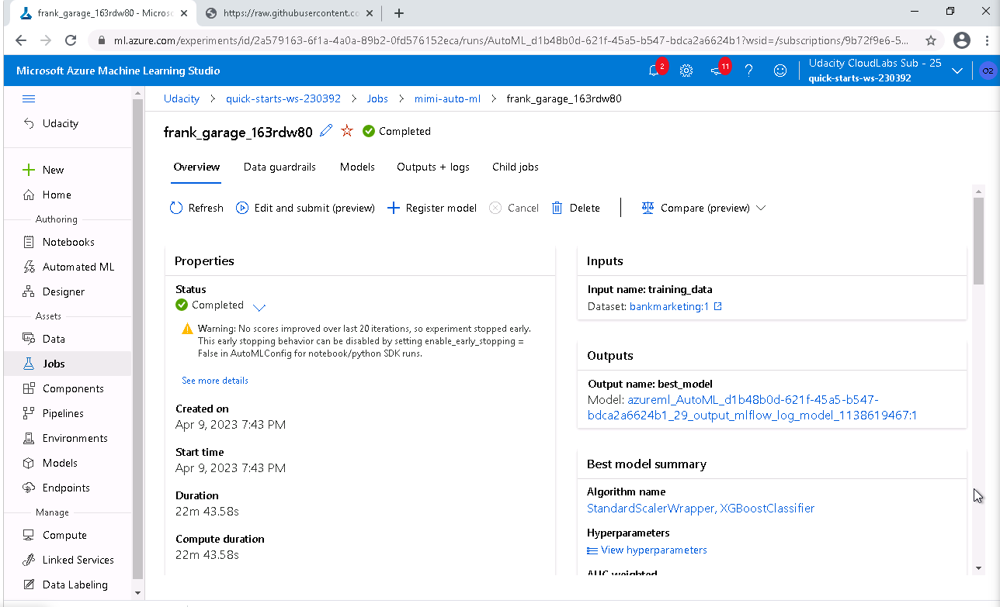

We are then able to see all the models that the experiment ran and select the best one. In my experiment, the model used StandardScalerWrapper and XGBoostClassifier algorithms to get an AUC weighted score of 0.94505.
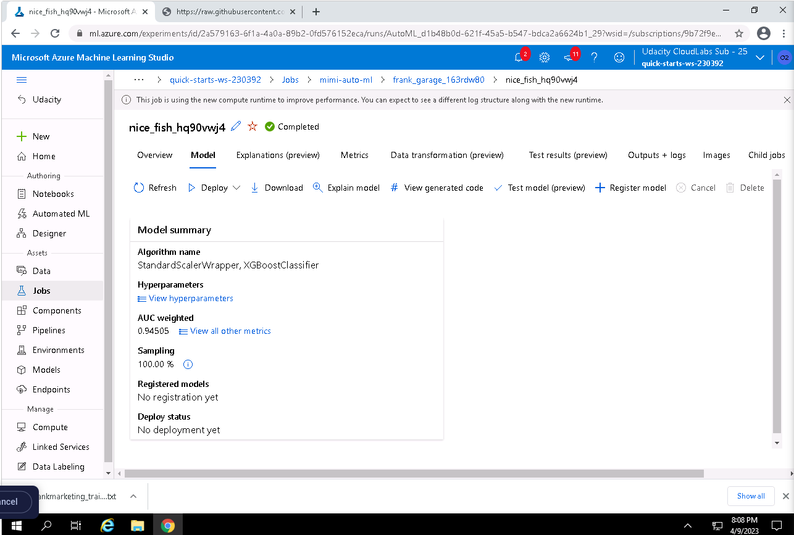

### 3. Deploy the Best Model
Using the model mentions above, I deployed it using an Azurre Container Instance and enabled authentication which will allow me to interact with the HTTP API service through POST requests.

### 4. Enable Logging
After deploying the model, I must enable Application Insights so that I can retrieve logs to monitor the model. I adjust the given `logs.py` script to match the workspace configuration of my Azure account and enable insights.
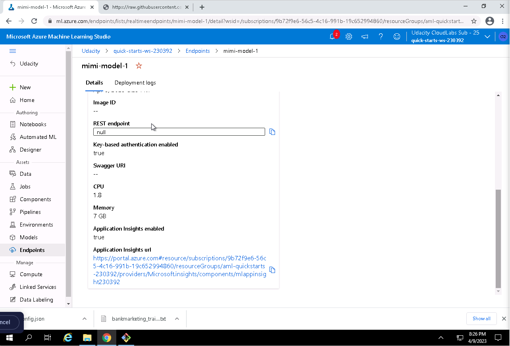
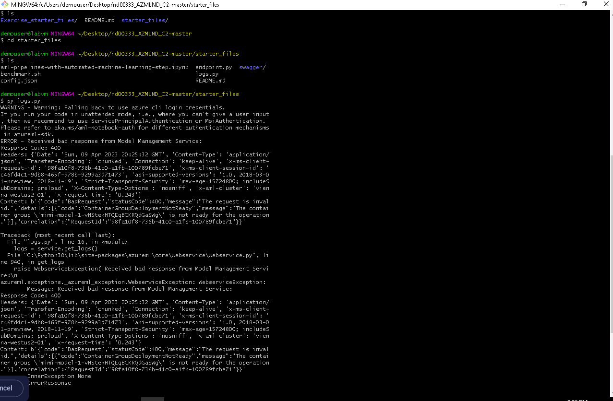

### 5. Swagger Documentation
Next I consume the model through Swagger. It provides helpful information about the API requests and responses when provided the endpoint. Using the Swagger JSON file provided by Azure, I serve it through a given python script (with some changes to the port) and we are able to see the Swagger UI on a local container.
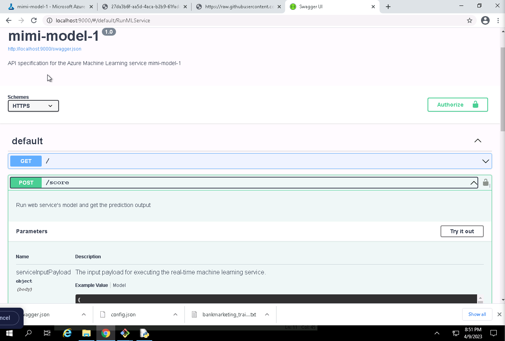

### 6. Consume Model Endpoints
Now that the endpoint is available, I can now interact with the trained model. Running the `endpoint.py` script to get a prediction for two example customers, we can see that the results were `yes` and `no`.
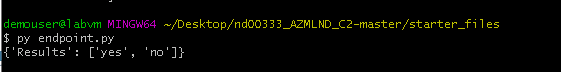

### 7. Create, Publish, and Consume a Pipeline
Using the Azure SDK for Python, I create a pipeline using AutoMLStep. I then submit the pipeline with the experiment above, as seen below:
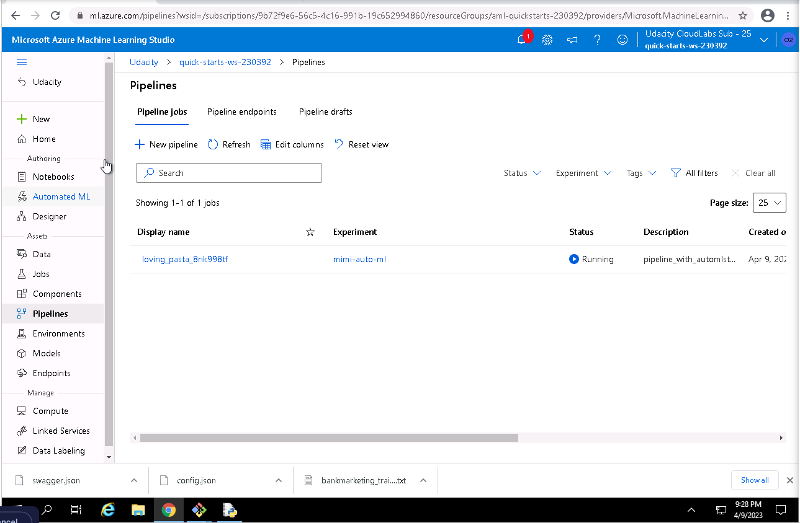

After the experiment is complete, I submit the pipeline to create the REST endpoint so that I can interact with the model. We can also see on the right that the endpoint is active.
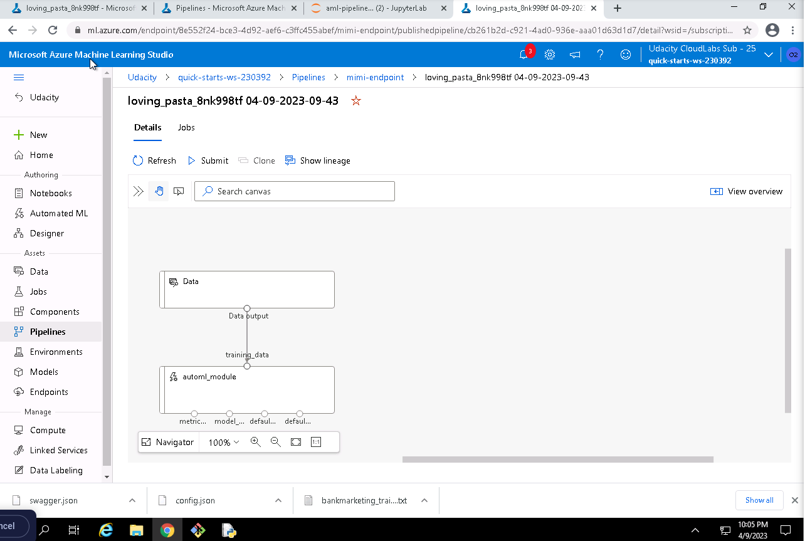
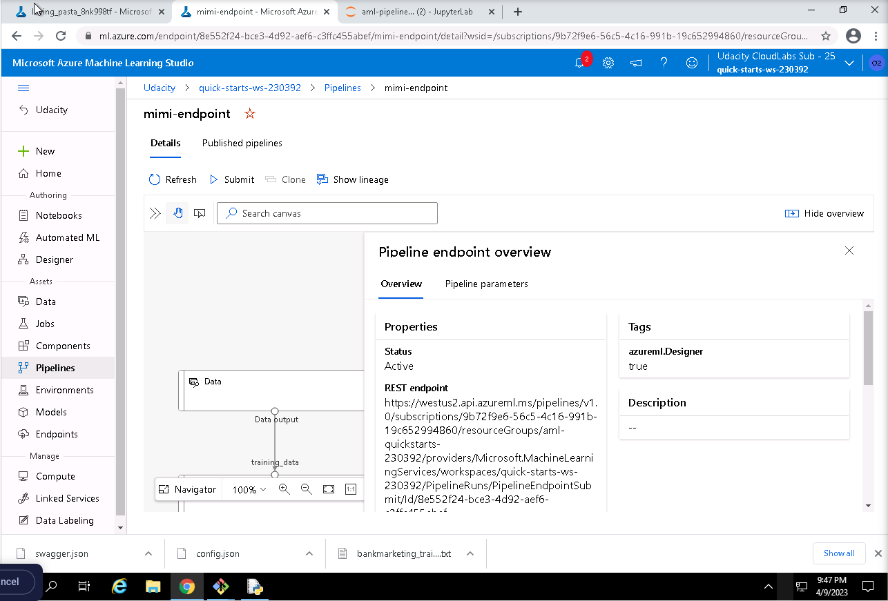

We can see that the pipeline consists of two parts: the dataset and the AutoML module. I then send a POST request to the active endpoint. Although the RunDetails widget was not working for me, you can see that it is completed within ML Studio (I accidentally missed this screenshot but you can see the finished run in the video).
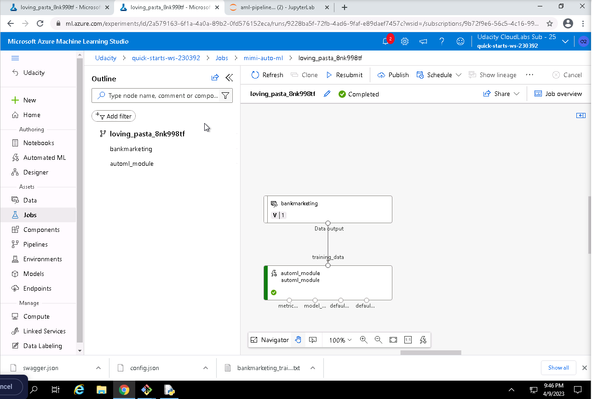
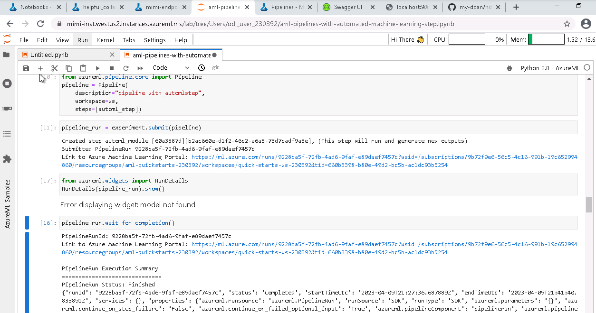

## Improvements
- Look into the different target metrics to improve the imbalanced classes of the dataset
- Be able to see the actual API request in Swagger UI (instead of example request and responses)
- Be able to configure own cluster and enable deep learning to improve model performance

## Screen Recording
The screen cast can be found in `sample_screenshots/mimi-course-2.mp4`. Because my computer does not have a microphone, I'm unable to provide audio. Instead, I have provided a script with corresponding timestamps.

0:00:00 - 0:00:29
Here I am showing my working deployed ML model endpoint. I use the terminal to run the `endpoint.py` script to make predictions for two data points (example customers). It predicts respectively, yes and no, to being influenced by the bank marketing campaign. The script is also replaced with the endpoint's scoring URI and key and so it has conducted the API request successfully as well.

0:00:30 - 0:01:02
Here I am showcasing my deployed pipeline. If we go under the tab Pipeline and click on Pipeline endpoints, you can see the published pipeline. Clicking on it, you can also see the REST endpoint and that it is active.

0:01:03 --
Finishing off the video, I show one of the finished AutoML experiement and job that was deployed through the pipeline.

